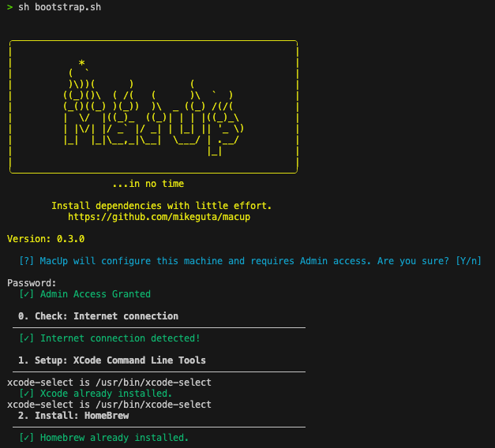

<h1 align="center">UP</h1>

<p align="center">
MacUp is a declarative dotfile configuration forked from the original 
<a href="https://github.com/juliantellez/up" target="_blank">UP project</a> created by <a href="https://github.com/juliantellez" target="_blank">Julian Tellez</a>.
Its main goal is to increase your productivity by making it trivial to install the most common tools developers tend to use<sup>*</sup>.
Get your MAC UP and running in no time, start up your machine with one command!
</p>

- [Install](#install)
- [Tools](#tools)
- [Shell](#shell)
- [Languages](#languages)
- [Utilities](#utilities)

- [Acknowledgements](#acknowledgements)
- [FAQ](#faq)

# Install

<p align="center">
  <a href="https://github.com/mikeguta/macup" target="_blank">
    
  </a>
</p>

Copy the following snippet into your current terminal.

```bash
sh -c "$(curl -fsSL https://raw.githubusercontent.com/mikeguta/macup/master/install.sh)"
```

# Tools
- [Xcode](https://developer.apple.com/xcode/): Installs necessary Command Line Tools.
- [Homebrew](https://brew.sh/): The missing package manager for macOS (or Linux).
- [git](https://github.com/git/git): A free and open source distributed version control system (included in XCode CL Tools)
- [gh](https://cli.github.com/): GitHub CLI brings GitHub to your terminal. Free and open source.


# Shell
- [ohmyz](https://ohmyz.sh/): A delightful, open source, community-driven framework for managing your ZSH configuration.
- [iterm2](https://www.iterm2.com/): A replacement for Terminal.
- [powerlevel10k](https://github.com/romkatv/powerlevel10k): The most awesome Powerline theme for ZSH around!
- [zsh syntax highlight](https://github.com/zsh-users/zsh-syntax-highlighting): Enables highlighting of commands whilst they are typed.
- [zsh autocomplete](https://github.com/zsh-users/zsh-completions): Completion scripts that are not available in Zsh yet.
- [font-hack-nerd-font](https://github.com/ryanoasis/nerd-fonts): Developer targeted fonts.
- [font-jetbrains-mono](https://github.com/JetBrains/JetBrainsMono): JetBrains Mono fonts.


# Languages
- [Nodejs](https://nodejs.org/en/): A JavaScript runtime built on Chrome's V8 JavaScript engine.
- [Python](https://github.com/python/cpython): An ideal language for scripting and rapid application development in many areas on most platforms.

# Utilities
- [fzf](https://github.com/junegunn/fzf): General-purpose command-line fuzzy finder.
- [jq](https://github.com/stedolan/jq): A lightweight and flexible command-line JSON processor.
- [htop](https://github.com/hishamhm/htop): An interactive process viewer.
- [the_silver_searcher](https://github.com/ggreer/the_silver_searcher): A code searching tool similar to ack, with a focus on speed.
- [tree](https://linux.die.net/man/1/tree): A depth indented listing of files.
- [wget](https://github.com/jay/wget): A free utility for non-interactive download of files from the Web.
- [z](https://github.com/rupa/z): Tracks your most used directories, based on 'frecency'.

# cli/Binaries
- [awscli](https://github.com/aws/aws-cli): Unified command line interface to Amazon Web Services.
- [colima](https://github.com/abiosoft/colima): Colima - container runtimes on macOS (and Linux) with minimal setup.
- [docker](https://github.com/docker/cli): A self-sufficient runtime for containers.
- [docker-compose](https://docs.docker.com/compose/reference/): Define and run multi-container applications with Docker.
- [mas](https://github.com/mas-cli/mas): CLI for the Mac App Store.
- [terraform](https://github.com/hashicorp/terraform): Tool for building, changing, and versioning infrastructure safely and efficiently.
- [vault](https://github.com/hashicorp/vault): Tool for securely accessing secrets.
- [ngrok](https://ngrok.com/): A multiplatform tunnelling and reverse proxy.
- [vagrant](https://www.vagrantup.com/): Development Environments Made Easy.

# Browsers (optional)
- [firefox](https://www.mozilla.org/en-US/firefox/): Free and open-source web browser developed by the Mozilla Foundation.
- [google-chrome](https://www.google.com/chrome/): A cross-platform web browser developed by Google.

# Editors
- [visual-studio-code](https://code.visualstudio.com/): Code editor redefined and optimized for building and debugging modern web and cloud applications. 

# Productivity
- [spectacle](https://www.spectacleapp.com/): Move and resize windows with ease.
- [trailer](https://ptsochantaris.github.io/trailer/): Track pull requests and issues across repositories.
- [day-o](https://shauninman.com/archive/2011/10/20/day_o_mac_menu_bar_clock): Menu bar clock replacement with a simple calendar for your Mac.

# Communication (optional)
- [slack](https://slack.com/): Brings all your communication together.
- [zoom](https://www.zoom.us/): Video communication and virtual meeting platform.
- [microsoft-teams](https://www.microsoft.com/en/microsoft-teams/group-chat-software/): Meet, chat, call, and collaborate in just one place.
- [spotify](https://www.spotify.com): Music for everyone.

# Configuration files

- [iterm](./config/iterm.json): Iterm2 profile.

# Mac Configuration
Please read the [configurations](./dependencies/mac.sh) before applying them. Note that you can always reset them by typing:

```
defaults delete <domain>; # sets domain to default settings
killall <domain>; # restarts domain

e.g
defaults delete Dock;
kill all Dock;
```

# Iterm Profile

UP uses a dynamic profile [see](https://www.iterm2.com/documentation-dynamic-profiles.html). To enable it do:

```
Iterm2 >
    Preferences >
        Profiles > UP Config >
            Other Actions > Set as Default
```

<p align="center">
  <a href="https://github.com/mikeguta/macup" target="_blank">
    
  </a>
</p>

# Color Presets

Color presets can be downloaded by following [this url](https://github.com/mbadolato/iTerm2-Color-Schemes/blob/master/README.md). Alternatively you can
follow the description below and import them from the color_presets folder.

```
Iterm2 > Preferences > Profiles > Colors > Color Presets > Import
```

# Acknowledgements
These configs and dotfiles stand on the shoulders of the following giants:

- https://github.com/minamarkham/formation
- https://github.com/mathiasbynens/dotfiles
- https://github.com/kevinSuttle/macOS-Defaults

# FAQ

- Have you tested these dotfiles?

  Yes, currently tested on:

  - macOS Monterey - 12.7.1

# Footnotes
<sup>*</sup>This list is somewhat opinionated and assumes you have permission to install all the tools in it. I would hope to add more support for more tools people generally use.